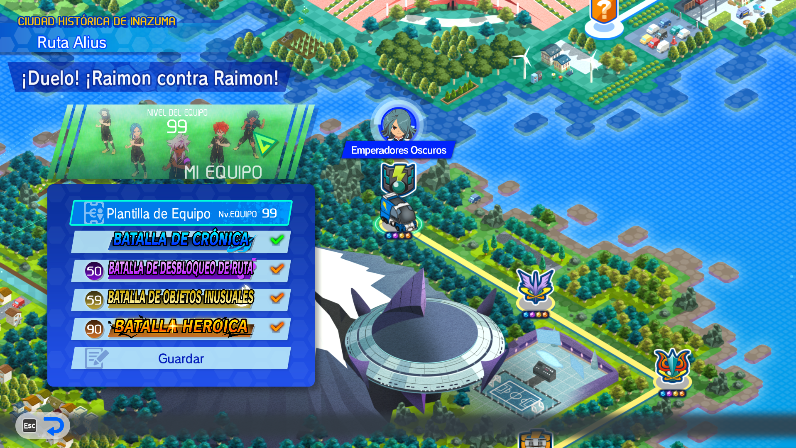

# How To Use - Chronicle Mode
The chronicles mode is the menu used to automatically farm in the game's chronicles mode of Inazuma Eleven Victory Road.

## $$\color{blue}💻Options$$

You can configure the following options in the menu:
- Turn audio on/off.
- Choose the audio execution type (every match: will execute an audio whenever a match ends / autofarm finished: when all the matches finishes).
- Target monitor: the screen on which the video game is located.
- Total nº of matches to execute.
- The "run autofarm" that starts the application.
- A panel with the farming results. 

...

## $$\color{blue}📑Steps$$

1. First, open the video game Inazuma Eleven Victory Road, and open the chronicle mode (fullscreen mode, in the main screen).
2. Select the desired match and just enter into the difficulty menu (do not select the difficulty).
3. Click the "Run Autofarm" button (click into the map if the game application is not focused).

4. Check if it's working correctly. If you haven't selected Heroic difficulty and the match hasn't started, stop the execution and start again. If it's working correctly, don't move the mouse or switch applications to avoid any error.
5. Enjoy it!!!

> [!NOTE]
> If you wish to reopen the Autofarmer application window to view real-time results or use your computer, there is a 5- to 25-minute interval during the first half when the Autoclicker does not send any type of input into the system. Use this time to take care of other tasks.   

**Click on the following link to see a small tutorial** -> [https://drive.google.com/file/d/1Nu3Qu4uc0pU8HVw0bWP-laL7_xCqmKfs/view?usp=sharing](https://drive.google.com/file/d/1Nu3Qu4uc0pU8HVw0bWP-laL7_xCqmKfs/view?usp=sharing)

## $$\color{blue}🔩Requirements$$

- Fullscreen mode.
- Once started, can´t use the computer (works as an autoclicker, except for minutes 5-25 of the first half).
- All difficulties must have been unlocked beforehand.

