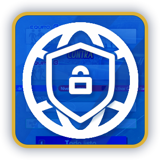
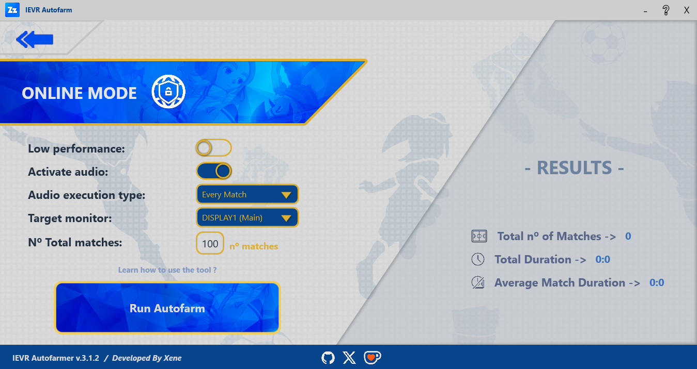
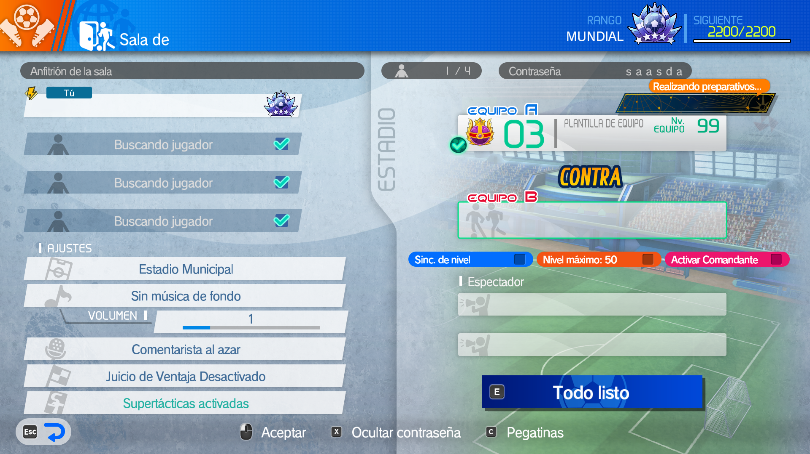
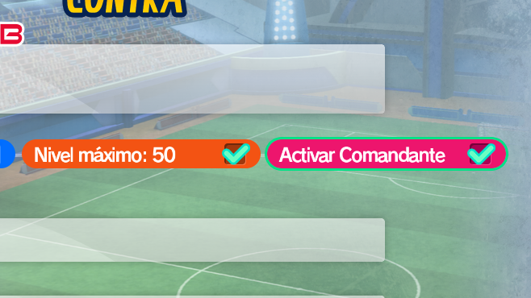

# How To Use - Online Mode

The online mode will allow you to farm with another player in private online matches.

> ![WARNING]
> For this to work, both players must have the IEVR Autofarmer app downloaded and run it at the same time (more or less)

## $$\color{blue}💻Options$$

You can configure the following options in the menu:

- Change to low performance (enable this option if your match takes a long time to load or if the match doesn't start).
- Turn audio on/off.
- Choose the audio execution type (every match: will execute an audio whenever a match ends / autofarm finished: when all the matches finishes).
- Target monitor: the screen on which the video game is located.
- Total nº of matches to execute.
- The "run autofarm" that starts the application.
- A panel with the farming results.

...

## $$\color{blue}📑Steps$$

1. First, open the video game Inazuma Eleven Victory Road, and open the competition mode > compete online > lobby match > create private lobby and join it (fullscreen mode, in the main screen). **The other user must join the room you created**.
2. Join one of the two sides (visitor or local) and choose the team you want to play with. The other player must do the same (do not press the "ready" button and activate the commander mode).

¡¡¡IMPORTANT¡¡¡ The commander mode must be activated.

3. Click the "Run Autofarm" button (click into game screen if the game application it is not focused). You can do **windows + tab** to switch between applications.
4. Check if it's working correctly. If the application didn't start the match, stop the execution and start again. If it's working correctly, don't move the mouse or switch between applications to avoid any error.
5. Enjoy it!!!

> [!NOTE]
> If you wish to reopen the Autofarmer application window to view real-time results or use your computer, there is a 5- to 25-minute interval during the first half of the match when the Autoclicker does not send any type of input into the system. Use this time to take care of other tasks.

## $$\color{blue}🔩Requirements$$

- ---> Both players must have the application <---
- Fullscreen mode.
- Once started, can´t use the computer (works as an autoclicker, except for minutes 5-25 of the first half).
- If you're experiencing lag, load the game beforehand.
- Use low performance if the match does not start or the commander is not activated during the process.
