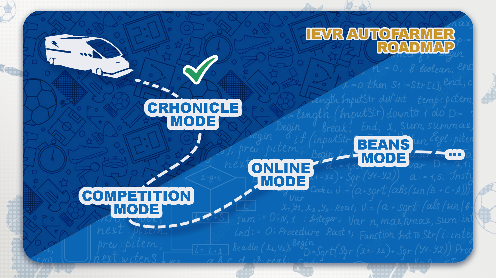
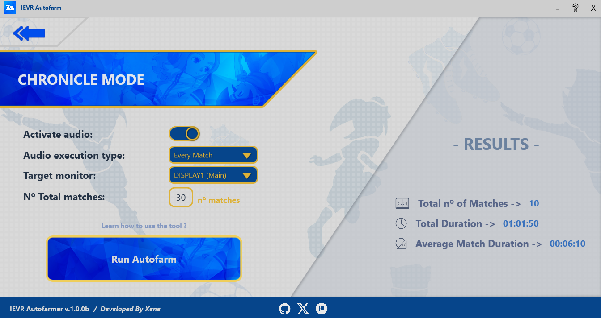

# IEVR Autofamer
> [!NOTE]
> This tool was developed by <ins>**AG_Xene**</ins>. Its current status is "**under development**" -> its functionalities will continue to be expanded in order to improve the tool and provide an amazing user experience.


> ◻️ Created with Windows Presentation Foundation (WPF).

> ◻️ Only for pc users. Not available for console users.

## $$\color{blue}⚽Welcome !!!$$

 
Welcome to IEVR Autofarmer !!! Thanks to this tool, you can solve the problem of having to manually farm spirits, beans, or other items in each match, **allowing you to do it automatically without needing to be attentive to the computer or controller**, using a screen color detection system that knows when the game ends and starts.


### <ins>**Features**</ins>
- Detects when a match has ended.
- Can configure some parameters of the autofarmer (audio, number of matches, target screen...).
- An audio system that plays a sound when a match is over or when the process is finished, that can be deactivated.
- Can select the number of matches to execute.

...

### ❓❓ <ins> **What is the difference compared to using a macro?** </ins> ❓❓

A macro will never know when a game has finished, wasting time and reducing efficiency. This problem is solved by IEVR Autofarmer app, which uses a screen color detection system to determine when a game is over. This way, twice as many games can be run in the same amount of time compared to using a macro.

``` Example: 1 hour using a macro = 8 matches / 1 hour using Autofarmer = 11 - 20 matches ```


...

## $$\color{blue}☕Roadmap \space and \space Support $$
The application will have the following planned updates:

1. Chronicle mode: autofarm in the chronicle mode. [Completed ✔️]
2. Competition mode: autofarm in the vs mode (singleplayer mode). [⌛ In development]
3. Online mode: autofarm in private lobbies. All the players must have the application. [Incomplete ❌]
4. Beans mode: autofarm the beans in the special training of story mode. [Incomplete ❌]
5. Improve the tool configuration and general features...



To continue updating the tool and streamlining the process, it would be a great help if you could help me with donations. The more support I receive, the sooner I will finish implementing all the features. After all, this is a project just for the fun of it, to help the Inazuma Eleven Victory Road community.


❗ ---------> ☕ [Link to help the developer](https://ko-fi.com/agxene) <---------- ❗

...


## $$\color{blue}❔How \space to \space Use \space It$$

Every mode has a similar way about how it works, all documented in their own .md file:
- [Chronicle Mode - How to use it](Docs/ChronicleMode_Help.md)

...


## $$\color{blue}🔗Dependencies \space and \space Licenses$$

### <ins>**License**</ins>

<details>

<summary>Open to view the license</summary>


The license used is **GNU General Public License, version 2** -> [https://www.gnu.org/licenses/old-licenses/gpl-2.0.en.html](https://www.gnu.org/licenses/old-licenses/gpl-2.0.en.html)

</details>

### <ins>**Dependencies and tools used**</ins>

<details>

<summary>Open to view the dependencies</summary>

The application was creted using the Windows Presentation Foundation (WPF) -> [https://learn.microsoft.com/en-us/dotnet/desktop/wpf/overview/](https://learn.microsoft.com/en-us/dotnet/desktop/wpf/overview/)

- The progamming language used as C#, with the Visual Studio 2026 ide and code editor.

Packages installed:
-  WpfScreenHelper (2.1.1) from micdenny -> [https://www.nuget.org/packages/WpfScreenHelper](https://www.nuget.org/packages/WpfScreenHelper)

>[!IMPORTANT]
> Some of the artistic elements and related styles are the property of **Level 5**, from **Inazuma Eleven Victory Road** video game.

</details>

...

## $$\color{blue}📄Releases \space and \space Other \space resources $$

### <ins>**Releases**</ins>

- 💿 Last update available ->
- 📁 Go to releases page ->

### <ins>**Images**</ins>

<details>

<summary>Open to view images of the application</summary>

*Main view*


*Chronicle mode view*


</details>
